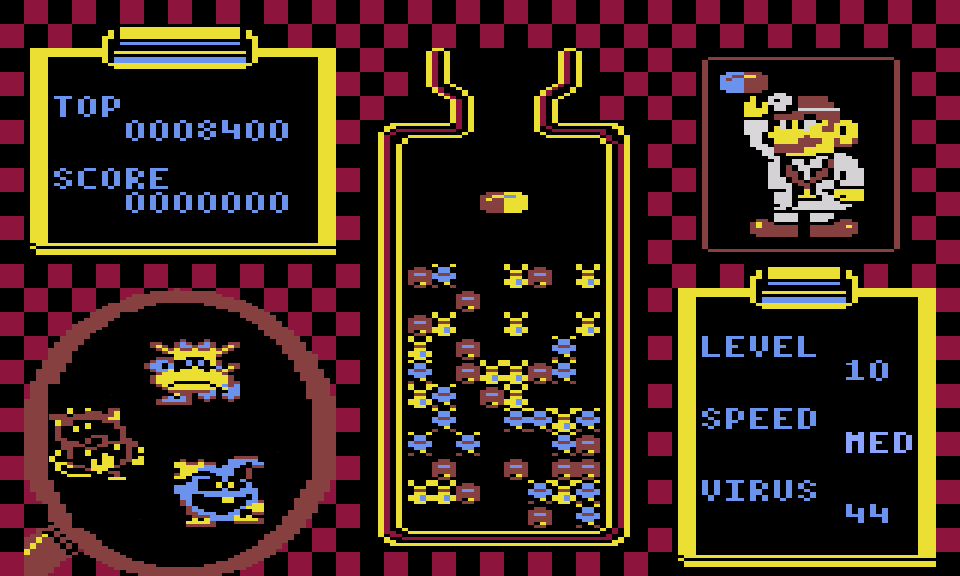

# Dr-Mario
Copy of the Dr Mario game

##  Overall info

The aim of the game is to destroy viruses. 

You must rotate and move the pills so that 4 pieces of the same colour are next to each other.

## Installation

 - Clone/download the repository
 - Run `index.html`
    

## Features

- Music
- Menu
- Difficulty
- Different levels
- Score system
- Animations

## Technologies

  
  
   

## Controls

- AD / Arrow left/right - move pill left/right
- W / Arrow up - rotate pill to left
- Shift left/right - rotate pill to right
- S / Arrow down - fall pill

